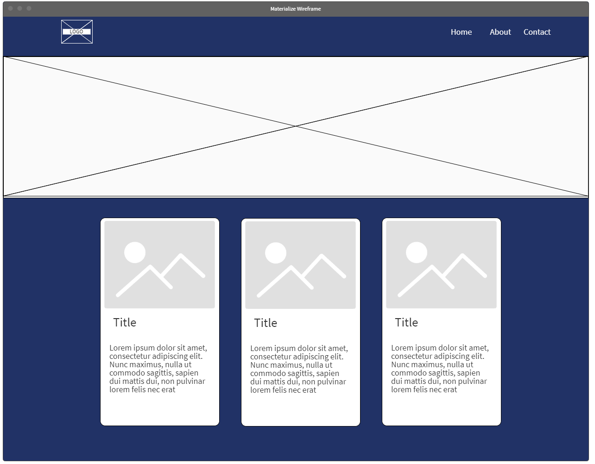
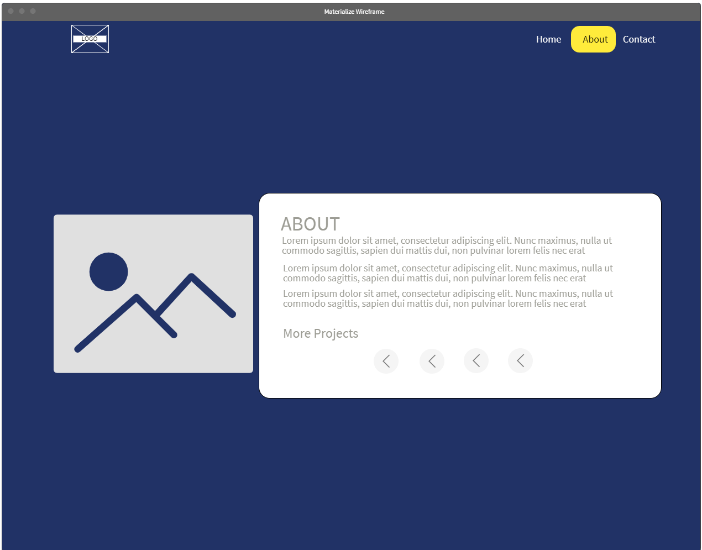
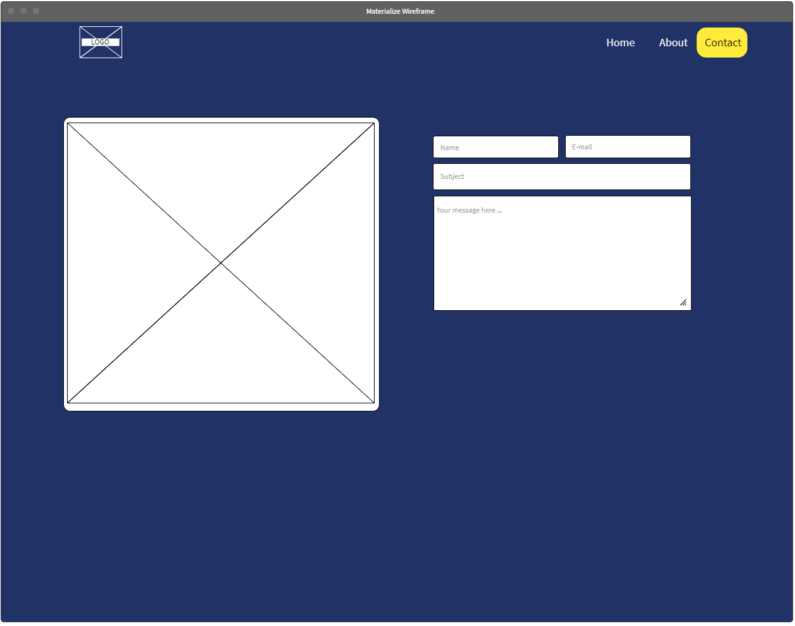

# Materialize App Starter - File

## Wireframes

Here are the basic layout we will try to accomplish. Let's dig into materialize and look at the basic classes offered and replicate the design below:

### Home Page

### About Page

### Contact Page

